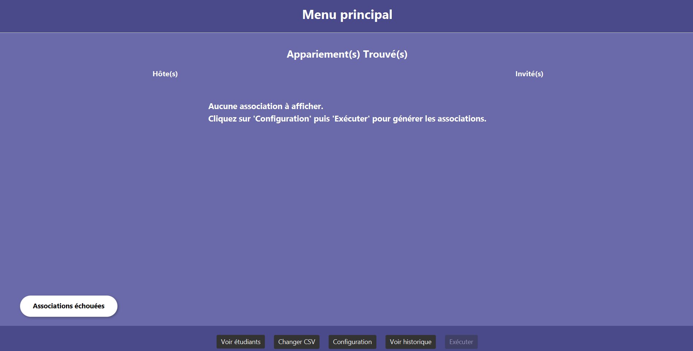

# Compte rendu — Projet IHM

## Membres du groupe

- **LEMAIRE Mano**
- **ROTY Clément**
- **SERGHERAERT Timothée**
---
## Comment executer le logiciel
Téléchargez les dernièrès versions de java et javafx, car l'appli a été developpé en java 23.0.1 et en javafx-sdk-24.0.1

Télechargez l'archive entière B5, ouvrez un terminal à l'intérieur et executer la commande suivante : 
```
java --module-path <votre_chemin>/javafx-sdk-24.0.1/lib --add-modules javafx.controls,javafx.graphics,javafx.base,javafx.swing -jar ApplicationFinale.jar
```
---
     
## Capture d’écran de l’application finale



---

## Lien vers les mockups Figma

- [Mockups Figma - Application IHM](https://www.figma.com/design/2I6NPZmP9v34Zh09NhOw38/Rendu-IHM?node-id=0-1&t=Ty4BwOmS3htID3Vw-1)

---

## Justification des choix de conception au regard des critères ergonomiques

### 1. **Guidage**
- **Incitations** : Les boutons sont clairement libellés (ex : "Valider", "Annuler"), et les zones interactives sont bien visibles.
- **Groupement / Distinction** : Les éléments sont regroupés par fonctionnalité ; zone de saisie à gauche et zone de résultats à droite, respectant la loi de proximité de la Gestalt.
- **Retour immédiat** : Lors d’une action, une réponse visuelle est fournie, comme la mise à jour dynamique de l’interface ou une boîte de dialogue de confirmation.
- **Lisibilité** : Utilisation de tailles de police lisibles et d’un contraste suffisant (fond clair, texte foncé).

### 2. **Charge de travail**
- **Concision** : Les dialogues utilisateurs sont courts et ne demandent que les informations nécessaires.
- **Actions minimales** : Les interactions sont limitées à un nombre réduit de clics grâce à une navigation fluide.
- **Affichage sobre** : L’affichage reste épuré, en évitant de surcharger visuellement l’interface.

### 3. **Contrôle explicite**
- Chaque action est déclenchée de manière volontaire (ex : validation via clic).
- L’utilisateur peut revenir à l’écran précédent ou annuler une action, gardant son contrôle sur l’interaction.

---

## Répartition des contributions

### LEMAIRE Mano
- Réalisation du maquettage basse fidélité
- Développement de l'application en JavaFX

### ROTY Clément
- Réalisation du maquettage haute fidélité
- Développement de l'application en JavaFX

### SERGHERAERT Timothée
- Réalisation du maquettage basse fidélité
- Réalisation du maquettage haute fidélité

---

## Vidéo de présentation

---

Disponible à la racine du dépôt

---
